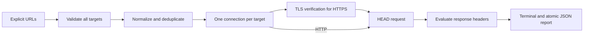

# Architecture

`surfacecheck/checker.py` owns URL validation, a small immutable target type, pure header rules, transport and result construction. HTTPS uses `ssl.create_default_context` with an optional private trust bundle and HTTP/1.1 ALPN. Metadata is collected from the same connection that sends HEAD. HTTP is deliberately accepted and reported as plaintext. Every connection is closed in a `finally` block.

`surfacecheck/cli.py` validates the complete input list before the first connection, deduplicates normalized targets, applies sequential pacing, prints results, atomically writes JSON and chooses an exit code. It does not load credentials or proxies and does not preserve a cookie jar. Server-controlled header values are evaluated in memory and not copied to reports.

`tests/test_surfacecheck.py` combines pure rule/input tests with actual loopback HTTP/TLS servers. Certificates and keys are generated per test-suite run and removed afterward. Temporary fixture directories inherit Windows ACLs to work in sandboxed AppContainers; these are disposable test credentials, never production credentials.

## Trust boundaries

URLs are operator input. Response headers are untrusted target input. The runtime HTTP parser bounds individual header lines and header count, but socket timeouts are not a strict wall-clock deadline. Reports include operator-supplied paths and network observations. No claim is made that this POC is suitable as a multi-tenant network service.

## Primary references

- [Python HTTP client](https://docs.python.org/3/library/http.client.html)
- [Python TLS contexts and certificate validation](https://docs.python.org/3/library/ssl.html)
- [HSTS specification, RFC 6797](https://www.rfc-editor.org/rfc/rfc6797)

The implementation intentionally reports simple policy observations rather than assigning a synthetic security score.
